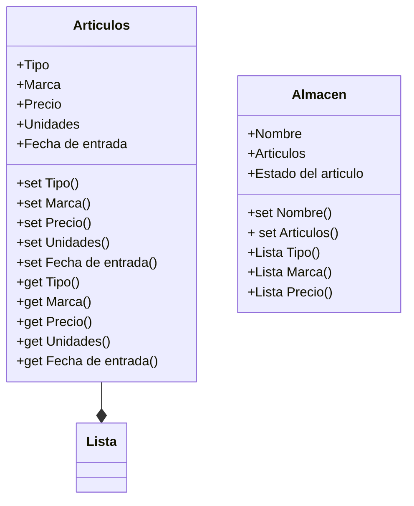

# Aplicación de gestion de inventario
## Programación Orientada a Objetos - Gabriel Huertas 
Repositorio del desarrollo de un programa en python el cual servira para la gestión del inventario de un almacen
## Funcionalidades propuestas
- Busqueda de articulos por nombre, marca, rango de precio, fecha de almacenamiento.
- Funcionalidad de registro de las operaciones realizadas en la operación.
- Funcionalidad de crear un documento .txt con la lista de los articulos en el almacen.
- funcionalidad de crear prioridades de venta teniendo en cuenta la fecha de almacenamiento.
- Permanencia de datos a traves de archivos 
## Diagrama de clases 

