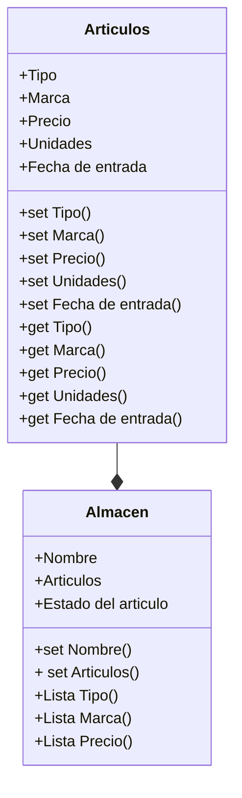

# Aplicación de gestion de inventario
## Programación Orientada a Objetos - Gabriel Huertas 
Repositorio del desarrollo de un programa en python el cual servira para la gestión del inventario de un almacen
## Funcionalidades propuestas
- Ingreso y retiro de articulos.
- Busqueda de articulos por nombre, marca y  rango de precio.
- Permanencia de datos a traves de archivos Json.
- Consulta de la lista del inventario
## Diagrama de clases 

